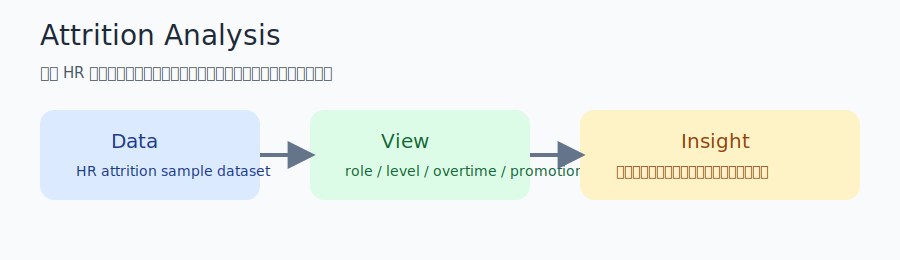

# Attrition Analysis

## Overview

公開 HR attrition データを使って、離職率の偏りをどこから説明できるかを整理するプロジェクトです。  
職種、JobLevel、残業、昇進間隔のような観点を分解し、分析からどこまで対策の優先順位を付けられるかを README で説明できる形にまとめます。

1 分説明:
全体離職率を出すだけで終わらせず、「どの層で離職率が高いか」「残業や昇進がどの程度関係しそうか」を切り分けて、People Analytics の入口として話せるようにした分析です。

## Dataset

- データセット: IBM HR Analytics Employee Attrition & Performance の公開サンプル
- 出典: [Kaggle dataset page](https://www.kaggle.com/datasets/uniabhi/ibm-hr-analytics-employee-attrition-performance)
- 利用方針: CSV は commit せず、`data/raw/attrition.csv` に配置して使う前提
- ターゲット: `Attrition`

## Approach

- まず全体離職率を把握
- つぎに `JobRole`, `JobLevel`, `OverTime`, `YearsSinceLastPromotion` を軸に分解
- 相関だけで断定せず、ビジネス上の示唆に落とす
- 必要に応じてシンプルな分類モデルや feature importance を補助的に使う

## Results

元の分析 notebook から、公開版 README に残したい観察を安全な形で整理しています。

| 観察 | 公開版で残すポイント |
| --- | --- |
| 全体離職率 | 約 16.2% という全体像を先に共有する |
| 職種別 | Sales Representative の離職率が高く、職種差が大きい |
| JobLevel | level が低い層で離職率が高く、対策優先度を付けやすい |
| 補助観点 | OverTime と YearsSinceLastPromotion を補助説明変数として確認する |



## Analysis

- 離職率の高さだけでなく、対象人数と掛け合わせて優先順位を付ける必要がある
- JobLevel が低い層は母数が大きく、改善余地も大きい可能性がある
- 残業や昇進間隔は単独で断定せず、職種やレベルと組み合わせて読むほうが自然

README では、面接でそのまま話せるように「発見 3 点」を残します。

1. 全体像を把握した
2. 偏りが大きいセグメントを見つけた
3. 次に深掘りすべき変数を絞った

## Setup

```bash
pip install pandas seaborn matplotlib scikit-learn jupyter
```

想定ファイル配置:

```text
data/raw/attrition.csv
```

notebook の入口:

```bash
jupyter lab notebooks/attrition_portfolio.ipynb
```

## Future Work

- 職種と JobLevel の交互作用を明示する
- シンプルな分類モデルを補助的に追加する
- README 用の図を実データから自動生成する
- 離職率だけでなく人数と組み合わせた優先順位表を作る
