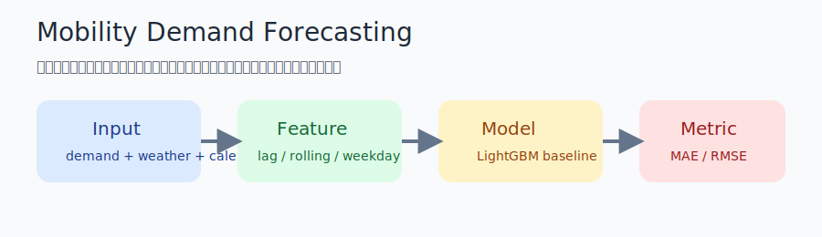

# Mobility Demand Forecasting

## Overview

公開の移動需要データを使って、時系列需要予測を行うプロジェクトです。  
元の需要予測 notebook で扱っていた「lag 特徴量」「移動平均」「曜日」「外部要因」という考え方だけを残し、業務固有名詞や社内データを含まない安全な構成へ置き換えています。

1 分説明:
需要履歴と外部要因を組み合わせて、将来の利用数を予測するプロジェクトです。  
単純な時系列ではなく、曜日・休日・天候のような特徴量を加えて、実務で人員配置や在庫配分に使える形へ寄せています。

## Dataset

- データセット: UCI Bike Sharing Dataset
- 出典: [UCI Machine Learning Repository](https://archive.ics.uci.edu/ml/datasets/bike%2Bsharing%2Bdataset)
- 利用方針: 公開データを `data/raw/day.csv` または `data/raw/hour.csv` として配置して使う
- 目的変数: `cnt` などの需要量カラム

## Approach

- 時系列順に train / validation / test を分ける
- `lag`, `rolling mean`, `weekday`, `holiday`, `workingday`, `weather` を特徴量にする
- ベースラインは LightGBM を想定
- 評価は `MAE` と `RMSE` を中心に見る
- 外れ日を確認し、予測が外れる条件を説明できるようにする

## Results

元 notebook から持ち出せる価値を、公開データ向けの比較軸に変換しています。

| 項目 | 公開版で見せる内容 |
| --- | --- |
| 主指標 | MAE / RMSE |
| 主な特徴量 | lag, rolling mean, weekday, holiday, weather |
| モデル | LightGBM baseline |
| 説明したいこと | ピーク需要の予測、外れ日の把握、運用への使いどころ |



## Analysis

- 直近の需要履歴は依然として強い説明力を持つ
- 曜日や休日といったカレンダー要因は、周期的な変動の説明に向いている
- weather などの外部要因を入れることで、単純な lag だけでは拾いづらい変動を補いやすい

元 notebook では、lag / 移動平均 / 曜日 / キャンペーン要因を見ていました。  
公開版ではそれを `lag / rolling / calendar / weather` に置き換えています。

## Setup

```bash
pip install pandas scikit-learn lightgbm matplotlib jupyter
```

想定ファイル配置:

```text
data/raw/day.csv
```

notebook の入口:

```bash
jupyter lab notebooks/mobility_demand_portfolio.ipynb
```

## Future Work

- 日次と時間帯予測を分けて比較する
- 祝日やイベントフラグの扱いを改善する
- 外れ日を自動抽出して README 用の事例を作る
- ベースラインに線形回帰や naive forecast を追加する
