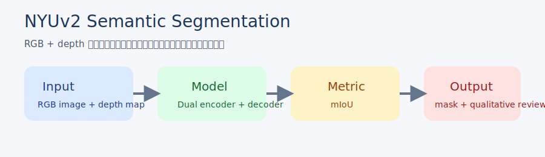

# NYUv2 Semantic Segmentation

## Overview

RGB 画像と depth map を組み合わせて、室内シーンのセマンティックセグメンテーションを行うプロジェクトです。  
公開版では、元 notebook の発想をそのまま載せるのではなく、公開利用可能な `NYUv2` データセットを前提に、再現しやすい構成へ整理しています。

1 分説明:
室内画像をクラスごとに塗り分ける課題に対して、RGB に加えて depth 情報を使うことで境界や形状情報を補い、mIoU を軸に改善を考えるプロジェクトです。

## Dataset

- データセット: NYU Depth V2
- 出典: [NYU Depth V2 dataset page](https://cs.nyu.edu/~fergus/datasets/nyu_depth_v2.html)
- 利用方針: 公開版ではデータそのものは含めず、ユーザーが別途取得して `data/raw/nyuv2/` に配置する前提です
- 使う情報: RGB image, depth map, semantic label

## Approach

- RGB と depth を別ブランチで受ける dual encoder を想定
- encoder は `MiT-B5` 系、decoder は segmentation head を前提に整理
- augmentation は `RandomResizedCrop`, `CoarseDropout`, 幾何変換を採用
- optimizer は `AdamW`、評価は `mIoU`
- notebook では学習・検証・可視化の流れを 1 本に圧縮

## Results

公開版で記録したい比較軸を、README で先に固定しています。

| 項目 | 公開版で見せる内容 |
| --- | --- |
| 主指標 | mIoU |
| 比較軸 | RGB only と RGB + depth の違い |
| 改良点 | dual encoder、augmentation、scheduler |
| 定性的確認 | wall / floor / furniture の境界と取りこぼし |
| 失敗例 | depth ノイズの影響、細かいクラスの欠落 |



## Analysis

- 室内シーンでは色だけでは曖昧な境界が多いため、depth 情報を入れる価値がある
- 一方で depth の欠損やノイズをそのまま入れると逆効果になる可能性もある
- README では、単に「精度が上がった」ではなく、「どのクラスや境界で効いたか」を説明する

## Setup

```bash
pip install torch torchvision albumentations segmentation-models-pytorch pandas matplotlib jupyter
```

データ配置の想定:

```text
data/raw/nyuv2/
├── train/
│   ├── image/
│   ├── depth/
│   └── label/
├── valid/
└── test/
```

notebook の入口:

```bash
jupyter lab notebooks/nyuv2_portfolio.ipynb
```

## Future Work

- RGB only ベースラインとの定量比較を追加
- depth 前処理の有無でアブレーションを行う
- 推論結果の可視化を README 用に整える
- 学習ログと best checkpoint の扱いを軽量化する
