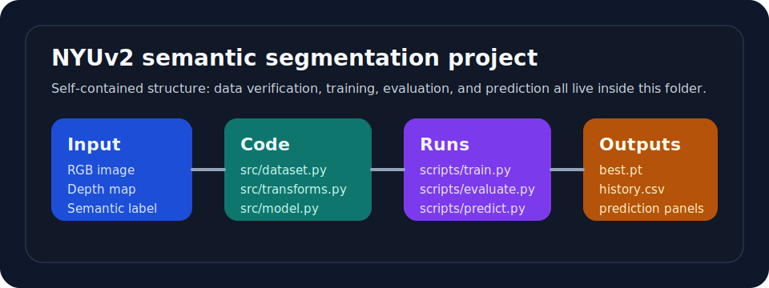

# NYUv2 セマンティックセグメンテーション

このフォルダは、画像セグメンテーション作品に必要なものをここだけで完結させる構成に作り直しています。  
`README` を読めば構成が分かり、`scripts/*.py` を叩けば学習・評価・推論まで実行できるようにしています。  
notebook は補助資料扱いで、実行の本体は Python スクリプトと `src/` のフルコードです。

## このフォルダで完結する内容

- `configs/`: 実験設定
- `scripts/`: 学習、評価、単体推論、データ確認の実行入口
- `src/`: データ読み込み、変換、モデル、学習ループ、指標計算、可視化
- `assets/`: この作品専用の図
- `outputs/`: 学習結果の出力先



## データセット

- データセット: NYU Depth V2
- 出典: [NYU Depth V2 dataset page](https://cs.nyu.edu/~fergus/datasets/nyu_depth_v2.html)
- この repo にデータ本体は含めません
- 学習コードは、以下のように RGB / depth / label を split ごとに並べた構成を前提にしています

```text
projects/nyuv2-semantic-segmentation/
├── data/
│   └── raw/
│       └── nyuv2/
│           ├── train/
│           │   ├── image/
│           │   ├── depth/
│           │   └── label/
│           ├── valid/
│           │   ├── image/
│           │   ├── depth/
│           │   └── label/
│           └── test/
│               ├── image/
│               ├── depth/
│               └── label/
├── assets/
├── configs/
├── scripts/
└── src/
```

ファイル名は `image / depth / label` で stem が一致している前提です。  
例: `train/image/0001.png` に対して `train/depth/0001.png` と `train/label/0001.png`

## 実装方針

- RGB only と RGB + depth を同じコードベースで比較できるようにした
- モデルは dual-branch の `RGBDUNet`
- depth を使わない場合は `rgb_only_unet.json`、使う場合は `rgbd_unet.json`
- 指標は `mIoU / pixel accuracy / mean accuracy`
- 学習結果は `outputs/<experiment_name>/` にまとめて保存する

この実装で見るポイントは次の 3 つです。

1. depth を入れたときに境界の切れ方が変わるか
2. RGB only に比べて mIoU がどう動くか
3. depth ノイズや細かいクラスでどこが崩れるか

## フォルダ構成

```text
projects/nyuv2-semantic-segmentation/
├── assets/
│   └── nyuv2-overview.svg
├── configs/
│   ├── rgb_only_unet.json
│   └── rgbd_unet.json
├── notebooks/
│   └── nyuv2_portfolio.ipynb
├── requirements.txt
├── scripts/
│   ├── evaluate.py
│   ├── predict.py
│   ├── train.py
│   └── verify_dataset.py
└── src/
    ├── config.py
    ├── dataset.py
    ├── engine.py
    ├── metrics.py
    ├── model.py
    ├── transforms.py
    └── utils.py
```

## セットアップ

```bash
cd projects/nyuv2-semantic-segmentation
pip install -r requirements.txt
python scripts/verify_dataset.py --config configs/rgbd_unet.json
```

## 学習

RGB + depth:

```bash
python scripts/train.py --config configs/rgbd_unet.json
```

RGB only:

```bash
python scripts/train.py --config configs/rgb_only_unet.json
```

## 評価

```bash
python scripts/evaluate.py --config configs/rgbd_unet.json
```

必要なら checkpoint を明示できます。

```bash
python scripts/evaluate.py --config configs/rgbd_unet.json --checkpoint outputs/rgbd_unet_baseline/checkpoints/best.pt --split test
```

## 単一画像推論

```bash
python scripts/predict.py --config configs/rgbd_unet.json --checkpoint outputs/rgbd_unet_baseline/checkpoints/best.pt --image data/raw/nyuv2/test/image/0001.png --depth data/raw/nyuv2/test/depth/0001.png --output outputs/inference_0001.png
```

RGB only で見る場合は `rgb_only_unet.json` を使い、`--depth` を省略します。

## 主な出力

- `outputs/<experiment_name>/checkpoints/best.pt`: 最良 checkpoint
- `outputs/<experiment_name>/checkpoints/last.pt`: 最終 epoch checkpoint
- `outputs/<experiment_name>/reports/history.csv`: epoch ごとの学習履歴
- `outputs/<experiment_name>/reports/summary.json`: best epoch と最終指標
- `outputs/<experiment_name>/reports/test_metrics.json`: 評価結果
- `outputs/<experiment_name>/predictions/`: 可視化画像

## 面接で話すときの要約

この作品は、NYUv2 を使った室内シーンのセマンティックセグメンテーションです。  
RGB only と RGB + depth の両方を同じ実装で比較できるようにしていて、学習、評価、単一画像推論までを notebook ではなく Python スクリプトで完結させています。  
見るべき点は、mIoU の差だけでなく、壁・床・家具の境界や depth ノイズの影響をどこまで説明できるかです。

## 今後の改善

- official split に完全に合わせた前処理スクリプトを追加する
- class-wise IoU を CSV でも保存する
- 混同行列の可視化を追加する
- small object 向けの loss や sampler を試す
